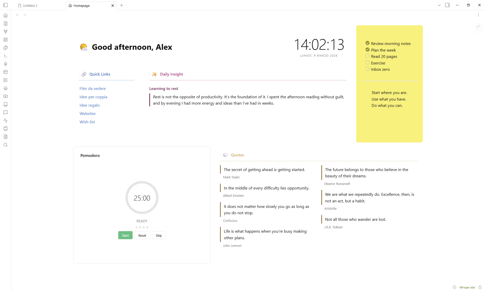
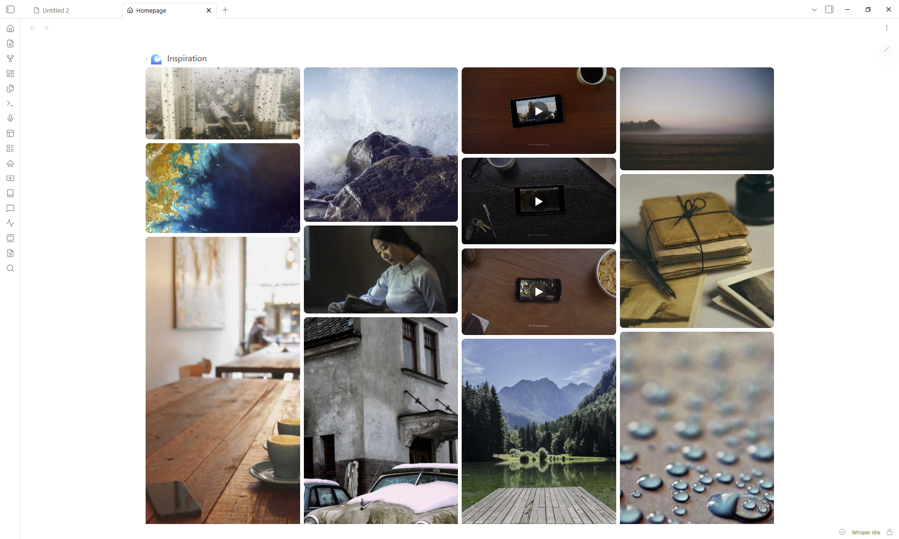

# Homepage Blocks

A composable, drag-and-drop homepage for [Obsidian](https://obsidian.md).



## Features

- **15 block types** -- greeting, clock, quotes, quick links, button grid, image gallery, video embed, embedded note, static text, HTML, bookmarks, recent files, pomodoro timer, spacer, random note
- **Drag-and-drop layout** with 2D resize (column span + row height)
- **Accent colors** with adjustable intensity (5--100%) that tint the entire card, including interactive controls
- **Per-block styling** -- title, emoji, divider, padding, elevation, border, opacity, backdrop blur, gradients
- **Responsive layout** -- blocks reflow in narrow panes via CSS container queries
- **Full-screen lightbox** for gallery images with keyboard and swipe navigation
- **Collapsible blocks** -- click any header to collapse or expand it
- **50 language presets** for greeting salutations
- **Zero runtime dependencies** beyond [GridStack](https://gridstackjs.com/)

## Installation

### From Community Plugins

1. Open **Settings > Community plugins > Browse**
2. Search for **Homepage Blocks**
3. Click **Install**, then **Enable**

### Manual

1. Download `main.js`, `manifest.json`, and `styles.css` from the [latest release](https://github.com/acaprino/obsidian-plugin-homepage/releases/latest)
2. Create `<vault>/.obsidian/plugins/homepage-blocks/`
3. Copy the three files into that folder
4. Enable the plugin in **Settings > Community plugins**

## Getting started

1. Click the **house icon** in the ribbon, or run `Open Homepage` from the command palette.
2. Click the **pencil FAB** to enter edit mode.
3. **Add Block** inserts new blocks. The **gear icon** opens settings, the **grip handle** reorders, and the **corner grip** resizes.
4. Click **Done** to exit edit mode.

## Block types

| Block | Description |
|-------|-------------|
| **Greeting** | Time-aware salutation with 50 language presets and custom emoji per time slot or random pool |
| **Clock** | Live clock with optional seconds and date display |
| **Quotes** | Multi-column quotes pulled from tagged notes or entered manually |
| **Quick Links** | Auto-generated list from a folder (with optional glob patterns like `Projects/*.md` or `**/*-draft.md`), plus manual links |
| **Button Grid** | Emoji-labeled buttons that open notes |
| **Image Gallery** | Grid or masonry layout from a vault folder, with lightbox |
| **Video Embed** | YouTube, Vimeo, Dailymotion -- supports playlists with shuffle |
| **Embedded Note** | Renders a vault note inline |
| **Static Text** | Freeform markdown with a quick-edit button |
| **HTML** | Custom HTML (sanitized for security) |
| **Bookmarks** | Web links and vault bookmarks in a grid |
| **Recent Files** | Your most recently modified notes |
| **Pomodoro** | Configurable work/break timer |
| **Spacer** | Empty space for layout gaps |
| **Random Note** | Surfaces a random note from a tag filter, with excerpt preview |



## Card styling

Every block shares these settings (open them with the gear icon):

- **Title** -- custom label, emoji (picker), size (h1--h6), show/hide, divider
- **Accent color** -- preset swatches or custom picker, intensity slider (5--100%)
- **Card** -- hide border, hide background, padding, elevation (shadow), border radius/width/style
- **Advanced** -- background opacity, backdrop blur, two-color gradient with angle

An accent color tints the header, background, border, divider, and all interactive controls (checkboxes, toggles, radio buttons) in one step.

## Settings

Open **Settings > Homepage Blocks**:

| Setting | Description |
|---------|-------------|
| Open on startup | Opens the homepage automatically when Obsidian launches |
| Startup open mode | Controls how the homepage opens on startup -- replace active tab, new tab, or sidebar |
| Open when empty | Opens the homepage when no other tabs are open |
| Manual open mode | Controls how the homepage opens from ribbon/command -- replace, new tab, or sidebar |
| Pin homepage tab | Prevents the homepage tab from being closed |
| Default columns | Grid column count (2, 3, 4, or 5) |
| Hide scrollbar | Hides the homepage scroll bar |
| Reset to default layout | Restores demo blocks (**cannot be undone**) |
| Export layout | Exports your layout as JSON |
| Import layout | Imports a layout from JSON |
| Layout presets | Applies a preset layout (Minimal, Dashboard, Focus) |

### Commands

| Command | Action |
|---------|--------|
| `Open Homepage` | Opens or focuses the homepage tab |
| `Toggle edit mode` | Switches between edit and view mode |
| `Add block` | Opens the add-block modal |

## CSS customization

You can override layout variables in a [CSS snippet](https://help.obsidian.md/Extending+Obsidian/CSS+snippets):

```css
:root {
  --hp-gap: 16px;
  --hp-padding: 24px;
  --hp-card-padding: 16px;
  --hp-content-max-width: 1400px;
  --hp-row-unit: 200px;
}
```

## Using theme colors in HTML blocks

Obsidian strips `<style>` tags from HTML blocks for security. To match your theme's look, use **inline `style` attributes** with Obsidian's CSS variables instead. These variables update automatically when you switch themes, so your HTML always stays consistent.

### Common theme variables

The table below lists the most useful variables. Use them as `var(--variable-name)` inside any inline `style`.

| Category | Variable | Description |
|----------|----------|-------------|
| Background | `--background-primary` | Main app background |
| | `--background-secondary` | Card / panel background |
| | `--background-modifier-border` | Standard border color |
| Text | `--text-normal` | Primary text |
| | `--text-muted` | Secondary / dimmed text |
| | `--text-faint` | Even lighter text |
| | `--text-accent` | Accent-colored text |
| Accent | `--color-accent` | Theme accent (links, focus rings) |
| | `--interactive-accent` | Active control background |
| | `--interactive-accent-hover` | Hovered control background |
| Radius | `--radius-s` / `--radius-m` / `--radius-l` | Border radius presets |

### A themed card

This example builds a card that adapts to any theme:

```html
<div style="
  background: var(--background-secondary);
  color: var(--text-normal);
  padding: 16px;
  border-radius: var(--radius-m);
  border: 1px solid var(--background-modifier-border);
">
  <h3 style="color: var(--color-accent); margin-top: 0;">Dashboard</h3>
  <p style="color: var(--text-muted);">This card follows the active theme.</p>
</div>
```

You can blend colors with `color-mix()` to create transparent or tinted variants:

```html
<div style="background: color-mix(in srgb, var(--color-accent) 10%, transparent);">
  Subtle accent tint
</div>
```

### Finding more variables

Open DevTools (`Ctrl+Shift+I`), inspect the `<body>` element, and filter the Computed tab for `--`. You will see every CSS variable the current theme defines.

## Support

Bug reports and feature requests: [GitHub Issues](https://github.com/acaprino/obsidian-plugin-homepage/issues)

## License

[MIT](LICENSE)
